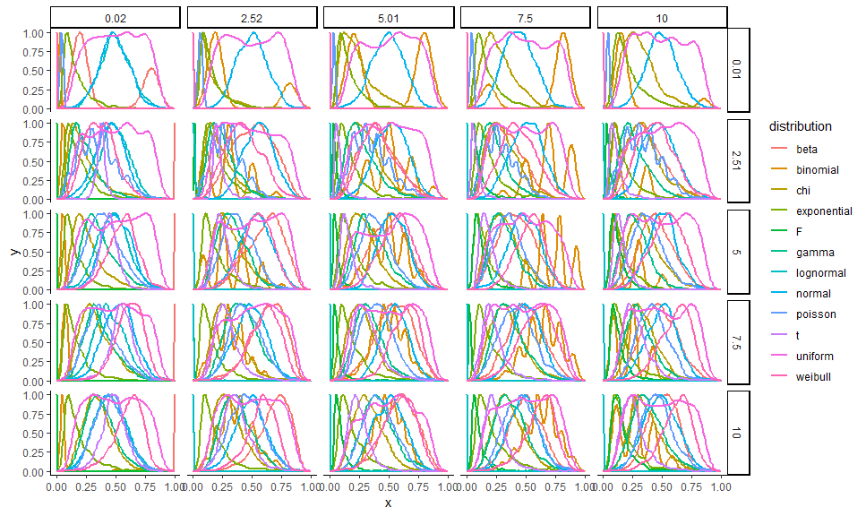
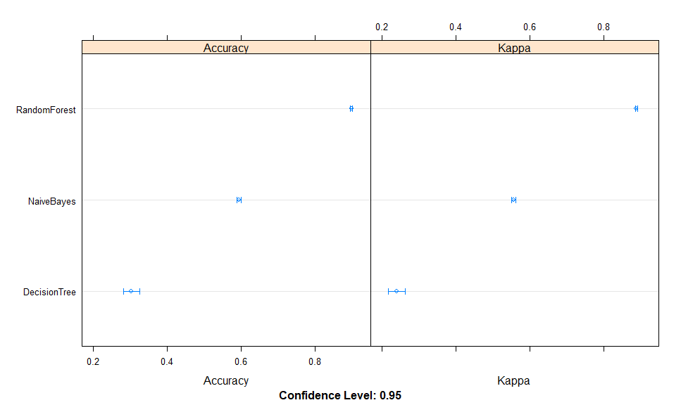
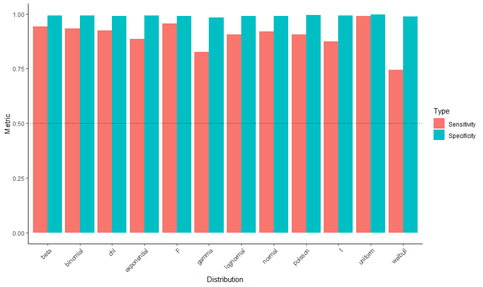
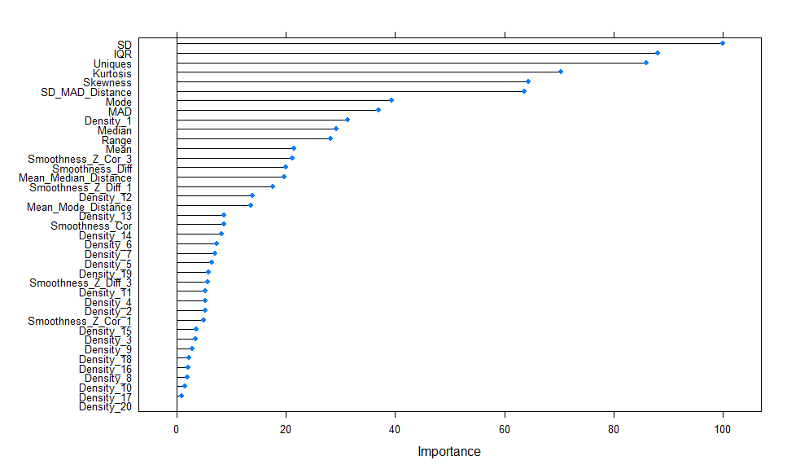
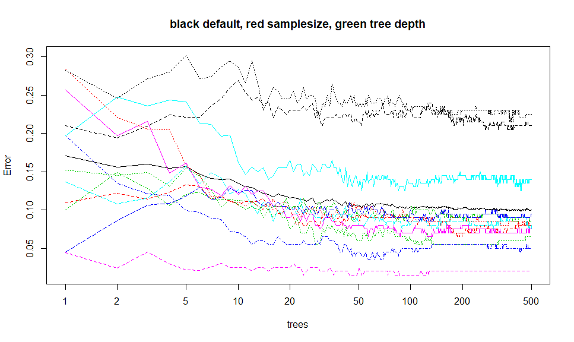
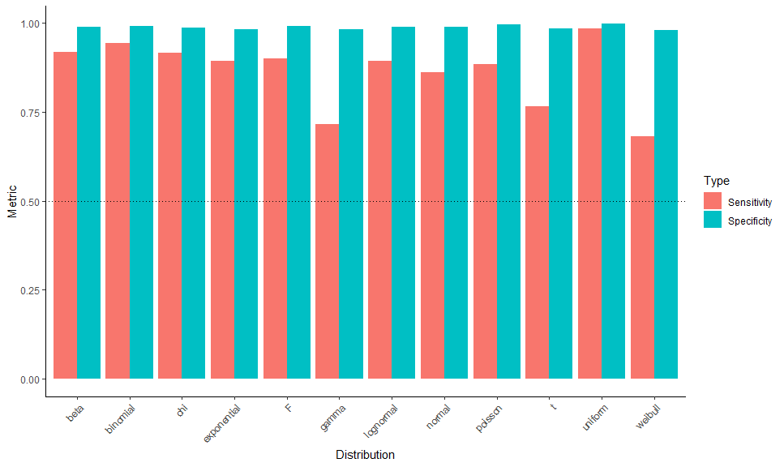

Classify Distributions using Machine Learning
================

  - [Introduction](#introduction)
  - [Methods](#methods)
      - [Parameters and Packages](#parameters-and-packages)
      - [Visualisation of
        distributions](#visualisation-of-distributions)
          - [Convenience function](#convenience-function)
          - [Data generation](#data-generation)
  - [Results](#results)
      - [Model training](#model-training)
          - [Preparation](#preparation)
          - [Training](#training)
      - [Model Selection](#model-selection)
          - [Model Comparison](#model-comparison)
          - [Best Model Inspection](#best-model-inspection)
      - [Random Forest Training with Feature
        Selection](#random-forest-training-with-feature-selection)
          - [Data Generation](#data-generation-1)
          - [Preparation](#preparation-1)
          - [Training](#training-1)
          - [Model Inspecction](#model-inspecction)
          - [Reduce Size and Save](#reduce-size-and-save)
  - [References](#references)

# Introduction

The goal of this article is to create a machine learning model able to
classify the distribution family of the data.

# Methods

## Parameters and Packages

``` r
# Plotting
library(ggplot2)

# Modelling
library(caret)
library(strip)
# library(parsnip)
# library(rsample)

# Optimizing
library(parallel)
library(doParallel)

# Analyzing
library(parameters)
library(bayestestR)
library(report)

set.seed(333)
```

## Visualisation of distributions

``` r
distributions <- data.frame()
size <-  1000
for(location in round(seq(0.01, 10, length.out = 5), digits=2)){
  for(scale in round(seq(0.02, 10, length.out = 5), digits=2)){
    x <- parameters::normalize(as.data.frame(density(rnorm(size, location, scale), n=100)))
    x$distribution <- "normal"
    x$location <- location
    x$scale <- scale
    distributions <- rbind(distributions, x)
    
    x <- parameters::normalize(as.data.frame(density(rbeta(size, location, scale), n=100)))
    x$distribution <- "beta"
    x$location <- location
    x$scale <- scale
    distributions <- rbind(distributions, x)
    
    x <- parameters::normalize(as.data.frame(density(rbinom(size, round(location)+1, scale/10^(nchar(round(scale)))), n=100)))
    x$distribution <- "binomial"
    x$location <- location
    x$scale <- scale
    distributions <- rbind(distributions, x)
    
    x <- parameters::normalize(as.data.frame(density(rchisq(size, location, scale), n=100)))
    x$distribution <- "chi"
    x$location <- location
    x$scale <- scale
    distributions <- rbind(distributions, x)
    
    x <- parameters::normalize(as.data.frame(density(rexp(size, scale), n=100)))
    x$distribution <- "exponential"
    x$location <- location
    x$scale <- scale
    distributions <- rbind(distributions, x)
    
    x <- parameters::normalize(as.data.frame(density(rf(size, location, scale), n=100)))
    x$distribution <- "F"
    x$location <- location
    x$scale <- scale
    distributions <- rbind(distributions, x)
    
    x <- parameters::normalize(as.data.frame(density(rgamma(size, location, scale), n=100)))
    x$distribution <- "gamma"
    x$location <- location
    x$scale <- scale
    distributions <- rbind(distributions, x)
    
    x <- parameters::normalize(as.data.frame(density(rlnorm(size, location, scale), n=100)))
    x$distribution <- "lognormal"
    x$location <- location
    x$scale <- scale
    distributions <- rbind(distributions, x)
    
    x <- parameters::normalize(as.data.frame(density(rpois(size, location), n=100)))
    x$distribution <- "poisson"
    x$location <- location
    x$scale <- scale
    distributions <- rbind(distributions, x)
    
    x <- parameters::normalize(as.data.frame(density(rt(size, location, scale), n=100)))
    x$distribution <- "t"
    x$location <- location
    x$scale <- scale
    distributions <- rbind(distributions, x)
    
    x <- parameters::normalize(as.data.frame(density(runif(size, location, location*2), n=100)))
    x$distribution <- "uniform"
    x$location <- location
    x$scale <- scale
    distributions <- rbind(distributions, x)
    
    x <- parameters::normalize(as.data.frame(density(rweibull(size, location, scale), n=100)))
    x$distribution <- "weibull"
    x$location <- location
    x$scale <- scale
    distributions <- rbind(distributions, x)
  }
}
ggplot(distributions, aes(x=x, y=y, colour=distribution)) +
  geom_line(size=1) +
  facet_grid(location ~ scale) +
  theme_classic()
```

<!-- -->

### Convenience function

``` r
generate_distribution <- function(family="normal", size=1000, noise=0, location=0, scale=1){
  if(family == "normal"){
    x <- rnorm(size, location, scale)
  } else if(family == "beta"){
    x <- rbeta(size, location, scale)
  } else if(family == "binomial"){
    x <- rbinom(size, round(location)+1, scale/10^(nchar(round(scale))))
  } else if(family == "chi"){
    x <- rchisq(size, location, scale)
  } else if(family == "exponential"){
    x <- rexp(size, scale)
  } else if(family == "F"){
    x <- rf(size, location, scale+0.1)
  } else if(family == "gamma"){
    x <- rgamma(size, location, scale)
  } else if(family == "lognormal"){
    x <- rlnorm(size, location, scale)
  } else if(family == "poisson"){
    x <- rpois(size, location)
  } else if(family == "t"){
    x <- rt(size, location, scale)
  } else if(family == "uniform"){
    x <- runif(size, location, location*2)
  } else if(family == "weibull"){
    x <- rweibull(size, location, scale)
  }
  return(x)
}
```

### Data generation

``` r
df <- data.frame()
for(distribution in c("normal", "beta", "binomial", "chi", "exponential", "F", "gamma", "lognormal", "poisson", "t", "uniform", "weibull")){
  for(i in 1:2000){
    
    size <- round(runif(1, 10, 1000))
    location <- runif(1, 0.01, 10)
    scale <- runif(1, 0.02, 10)
    
    x <- generate_distribution(distribution, size=size, location=location, scale=scale)
    
    density_Z <- parameters::normalize(density(x, n=20)$y)
    
    # Extract features
    data <- data.frame(
      "Mean" = mean(x),
      "SD" = sd(x),
      "Median" = median(x),
      "MAD" = mad(x, constant=1),
      "Mean_Median_Distance" = mean(x) - median(x),
      "Mean_Mode_Distance" = mean(x) - as.numeric(bayestestR::map_estimate(x, bw = "nrd0")),
      "SD_MAD_Distance" = sd(x) - mad(x, constant=1),
      "Mode" = bayestestR::map_estimate(x, bw = "nrd0"),
      "Range" = diff(range(x)) / sd(x),
      "IQR" = stats::IQR(x),
      "Skewness" = skewness(x),
      "Kurtosis" = kurtosis(x),
      "Uniques" = length(unique(x)) / length(x),
      "Smoothness_Cor" = parameters::smoothness(density(x)$y, method="cor"),
      "Smoothness_Diff" = parameters::smoothness(density(x)$y, method="diff"),
      "Smoothness_Z_Cor_1" = parameters::smoothness(density_Z, method="cor", lag=1),
      "Smoothness_Z_Diff_1" = parameters::smoothness(density_Z, method="diff", lag=1),
      "Smoothness_Z_Cor_3" = parameters::smoothness(density_Z, method="cor", lag=3),
      "Smoothness_Z_Diff_3" = parameters::smoothness(density_Z, method="diff", lag=3)
    )
    
    
    density_df <- as.data.frame(t(density_Z))
    names(density_df) <- paste0("Density_", 1:ncol(density_df))
    data <- cbind(data, density_df)
    
    data$Distribution <- distribution
    df <- rbind(df, data)
  }
  # write.csv(df, "classify_distribution.csv", row.names = FALSE)
}
```

# Results

## Model training

### Preparation

<!-- ```{r eval=FALSE, message=FALSE, warning=FALSE, include=FALSE} -->

<!-- # parsnip attempt -->

<!-- # Data clearning -->

<!-- df <- na.omit(df) -->

<!-- infinite <- is.infinite(rowSums(df[sapply(df, is.numeric)])) -->

<!-- df <- df[!infinite, ] -->

<!-- # Data partitioning -->

<!-- df_split <- rsample::initial_split(df, prop = 0.8, strata = "Distribution") -->

<!-- train <- training(df_split) -->

<!-- test  <- testing(df_split) -->

<!-- pipeline <- -->

<!--   recipes::recipe(Distribution ~ ., data = train) %>% -->

<!--   recipes::prep(training = train, retain = TRUE) -->

<!-- test <- recipes::bake(pipeline, new_data = test) -->

<!-- model_tree <- -->

<!--   decision_tree(mode = "classification") %>% -->

<!--   set_engine("rpart") %>% -->

<!--   fit(Distribution ~ ., data = recipes::juice(pipeline)) -->

<!-- test_results <- -->

<!--   data.frame( -->

<!--     Distribution = test$Distribution, -->

<!--     predicted_class = predict(model_tree, new_data = test) %>% -->

<!--       pull(.pred_class) -->

<!--   ) -->

<!-- yardstick::roc_auc(test_results, truth = Distribution, predicted_class) -->

<!-- yardstick::accuracy(test_results, truth = Distribution, predicted_class) -->

<!-- yardstick::conf_mat(test_results, truth = Distribution, predicted_class) -->

<!-- ``` -->

``` r
# Data clearning
df <- na.omit(df)
infinite <- is.infinite(rowSums(df[sapply(df, is.numeric)]))
df <- df[!infinite, ]

# Data partitioning


trainIndex <- caret::createDataPartition(as.factor(df$Distribution), p=0.1, list = FALSE)
train <- df[ trainIndex,]
test  <- df[-trainIndex,]


# Parameters
fitControl <- caret::trainControl(## 5-fold CV
                           method = "repeatedcv",
                           number = 5,
                           ## repeated ten times
                           repeats = 10,
                           classProbs = TRUE,
                           returnData = FALSE,
                           trim=TRUE,
                           allowParallel = TRUE)
# Set up parallel
cluster <- makeCluster(detectCores() - 1) # convention to leave 1 core for OS
registerDoParallel(cluster)
```

### Training

``` r
# Training
model_tree <- caret::train(Distribution ~ ., data = train, 
                 method = "rpart", 
                 trControl = fitControl)
model_rf <- caret::train(Distribution ~ ., data = train, 
                 method = "rf", 
                 trControl = fitControl)
model_nb <- caret::train(Distribution ~ ., data = train,
                 method = "naive_bayes",
                 trControl = fitControl)

stopCluster(cluster) # explicitly shut down the cluster
```

## Model Selection

### Model Comparison

``` r
# collect resamples
results <- resamples(list(
  "DecisionTree" = model_tree,
  "RandomForest" = model_rf,
  "NaiveBayes"= model_nb
  ))

# summarize the distributions
summary(results)
```

    ## 
    ## Call:
    ## summary.resamples(object = results)
    ## 
    ## Models: DecisionTree, RandomForest, NaiveBayes 
    ## Number of resamples: 50 
    ## 
    ## Accuracy 
    ##                   Min.   1st Qu.    Median      Mean   3rd Qu.      Max.
    ## DecisionTree 0.2395833 0.2479167 0.2500000 0.3039167 0.4015625 0.4083333
    ## RandomForest 0.8708333 0.8895833 0.8958333 0.8970000 0.9036458 0.9229167
    ## NaiveBayes   0.5562500 0.5791667 0.5895833 0.5931667 0.6036458 0.6479167
    ##              NA's
    ## DecisionTree    0
    ## RandomForest    0
    ## NaiveBayes      0
    ## 
    ## Kappa 
    ##                   Min.   1st Qu.    Median      Mean   3rd Qu.      Max.
    ## DecisionTree 0.1704545 0.1795455 0.1818182 0.2406364 0.3471591 0.3545455
    ## RandomForest 0.8590909 0.8795455 0.8863636 0.8876364 0.8948864 0.9159091
    ## NaiveBayes   0.5159091 0.5409091 0.5522727 0.5561818 0.5676136 0.6159091
    ##              NA's
    ## DecisionTree    0
    ## RandomForest    0
    ## NaiveBayes      0

``` r
# dot plots of results
dotplot(results)
```

<!-- -->

``` r
# Sizes
data.frame("DecisionTree" = as.numeric(object.size(model_tree))/1000,
           "RandomForest" = as.numeric(object.size(model_rf))/1000,
           "NaiveBayes" = as.numeric(object.size(model_nb))/1000)
```

    ##   DecisionTree RandomForest NaiveBayes
    ## 1     1329.648     7325.264   1931.424

### Best Model Inspection

``` r
model <- model_rf

# Performance
test$pred <- predict(model, test)
confusion <- confusionMatrix(data = test$pred, reference = as.factor(test$Distribution), mode = "prec_recall")
knitr::kable(data.frame("Performance" = confusion$overall))
```

|                | Performance |
| -------------- | ----------: |
| Accuracy       |   0.9005604 |
| Kappa          |   0.8915204 |
| AccuracyLower  |   0.8964916 |
| AccuracyUpper  |   0.9045211 |
| AccuracyNull   |   0.0833681 |
| AccuracyPValue |   0.0000000 |
| McnemarPValue  |         NaN |

``` r
# Prediction Table
knitr::kable(confusion$table / colSums(confusion$table), digits=2)
```

|             | beta | binomial |  chi | exponential |    F | gamma | lognormal | normal | poisson |    t | uniform | weibull |
| ----------- | ---: | -------: | ---: | ----------: | ---: | ----: | --------: | -----: | ------: | ---: | ------: | ------: |
| beta        | 0.94 |     0.00 | 0.00 |        0.03 | 0.00 |  0.03 |      0.00 |   0.00 |    0.00 | 0.00 |    0.00 |    0.02 |
| binomial    | 0.00 |     0.93 | 0.00 |        0.00 | 0.00 |  0.00 |      0.00 |   0.00 |    0.09 | 0.00 |    0.00 |    0.00 |
| chi         | 0.00 |     0.00 | 0.92 |        0.01 | 0.00 |  0.03 |      0.00 |   0.01 |    0.00 | 0.02 |    0.00 |    0.04 |
| exponential | 0.02 |     0.00 | 0.00 |        0.89 | 0.00 |  0.05 |      0.00 |   0.00 |    0.00 | 0.00 |    0.00 |    0.01 |
| F           | 0.00 |     0.00 | 0.01 |        0.03 | 0.96 |  0.01 |      0.03 |   0.00 |    0.00 | 0.02 |    0.00 |    0.02 |
| gamma       | 0.02 |     0.00 | 0.02 |        0.03 | 0.02 |  0.83 |      0.02 |   0.00 |    0.00 | 0.02 |    0.00 |    0.05 |
| lognormal   | 0.00 |     0.00 | 0.00 |        0.00 | 0.02 |  0.00 |      0.91 |   0.00 |    0.00 | 0.04 |    0.00 |    0.03 |
| normal      | 0.00 |     0.00 | 0.01 |        0.00 | 0.00 |  0.01 |      0.00 |   0.92 |    0.00 | 0.01 |    0.00 |    0.07 |
| poisson     | 0.00 |     0.07 | 0.00 |        0.00 | 0.00 |  0.00 |      0.00 |   0.00 |    0.91 | 0.00 |    0.00 |    0.00 |
| t           | 0.00 |     0.00 | 0.02 |        0.00 | 0.00 |  0.03 |      0.03 |   0.01 |    0.00 | 0.87 |    0.00 |    0.01 |
| uniform     | 0.01 |     0.00 | 0.00 |        0.00 | 0.00 |  0.00 |      0.00 |   0.01 |    0.00 | 0.00 |    0.99 |    0.01 |
| weibull     | 0.00 |     0.00 | 0.01 |        0.02 | 0.00 |  0.02 |      0.01 |   0.06 |    0.00 | 0.01 |    0.00 |    0.74 |

``` r
# Prediction Figure
perf <-  as.data.frame(confusion$byClass)[c("Sensitivity", "Specificity")]
perf$Distribution <- gsub("Class: ", "", row.names(perf))
perf <- reshape(perf, varying = list(c("Sensitivity", "Specificity")), timevar = "Type", idvar = "Distribution", direction = "long", v.names = "Metric")
perf$Type <- ifelse(perf$Type == 1, "Sensitivity", "Specificity")
ggplot(perf, aes(x=Distribution, y=Metric, fill=Type)) +
  geom_bar(stat = "identity", position = position_dodge(width = 0.9)) +
  geom_hline(aes(yintercept=0.5), linetype="dotted") +
  theme_classic() +
  theme(axis.text.x = element_text(angle = 45, hjust = 1))
```

<!-- -->

``` r
# Features
features <- caret::varImp(model, scale = TRUE)
plot(features)
```

<!-- -->

``` r
# N trees
plot(model$finalModel, log="x", main="black default, red samplesize, green tree depth")
```

<!-- -->

## Random Forest Training with Feature Selection

### Data Generation

``` r
df <- data.frame()
for(distribution in c("normal", "beta", "binomial", "chi", "exponential", "F", "gamma", "lognormal", "poisson", "t", "uniform", "weibull")){
  for(i in 1:2000){
    
    size <- round(runif(1, 10, 1000))
    location <- runif(1, 0.01, 10)
    scale <- runif(1, 0.02, 10)
    
    x <- generate_distribution(distribution, size=size, location=location, scale=scale)
    
    density_Z <- parameters::normalize(density(x, n=100)$y)
    
    # Extract features
    data <- data.frame(
      "SD" = sd(x),
      "MAD" = mad(x, constant=1),
      "Mean_Median_Distance" = mean(x) - median(x),
      "Mean_Mode_Distance" = mean(x) - as.numeric(bayestestR::map_estimate(x, bw = "nrd0")),
      "SD_MAD_Distance" = sd(x) - mad(x, constant=1),
      "Range" = diff(range(x)) / sd(x),
      "IQR" = stats::IQR(x),
      "Skewness" = skewness(x),
      "Kurtosis" = kurtosis(x),
      "Uniques" = length(unique(x)) / length(x)
    )
    
    
    data$Distribution <- distribution
    df <- rbind(df, data)
  }
}
```

### Preparation

``` r
# Data clearning
df <- na.omit(df)
infinite <- is.infinite(rowSums(df[sapply(df, is.numeric)]))
df <- df[!infinite, ]

# Data partitioning
trainIndex <- caret::createDataPartition(as.factor(df$Distribution), p=0.1, list = FALSE)
train <- df[ trainIndex,]
test  <- df[-trainIndex,]

# Set up parallel
cluster <- makeCluster(detectCores() - 1) # convention to leave 1 core for OS
registerDoParallel(cluster)
```

### Training

``` r
# Training
model <- randomForest::randomForest(as.factor(Distribution) ~ ., data = train, 
                 localImp = FALSE,
                 importance = FALSE,
                 keep.forest = TRUE,
                 keep.inbag = FALSE,
                 proximity=FALSE, 
                 maxDepth=5, 
                 maxBins=32, 
                 minInstancesPerNode=1, 
                 minInfoGain=0.0, 
                 maxMemoryInMB=128,
                 ntree = 10)
stopCluster(cluster) # explicitly shut down the cluster
```

### Model Inspecction

``` r
# Performance
test$pred <- predict(model, test)
confusion <- confusionMatrix(data = test$pred, reference = as.factor(test$Distribution), mode = "prec_recall")
knitr::kable(data.frame("Performance" = confusion$overall))
```

|                | Performance |
| -------------- | ----------: |
| Accuracy       |   0.8623819 |
| Kappa          |   0.8498710 |
| AccuracyLower  |   0.8577154 |
| AccuracyUpper  |   0.8669507 |
| AccuracyNull   |   0.0833488 |
| AccuracyPValue |   0.0000000 |
| McnemarPValue  |         NaN |

``` r
# Prediction Table
knitr::kable(confusion$table / colSums(confusion$table), digits=2)
```

|             | beta | binomial |  chi | exponential |    F | gamma | lognormal | normal | poisson |    t | uniform | weibull |
| ----------- | ---: | -------: | ---: | ----------: | ---: | ----: | --------: | -----: | ------: | ---: | ------: | ------: |
| beta        | 0.92 |     0.00 | 0.00 |        0.03 | 0.00 |  0.04 |      0.00 |   0.01 |    0.00 | 0.00 |    0.00 |    0.05 |
| binomial    | 0.00 |     0.94 | 0.00 |        0.00 | 0.00 |  0.00 |      0.00 |   0.00 |    0.11 | 0.00 |    0.00 |    0.00 |
| chi         | 0.00 |     0.00 | 0.91 |        0.01 | 0.01 |  0.04 |      0.01 |   0.01 |    0.00 | 0.04 |    0.00 |    0.05 |
| exponential | 0.03 |     0.00 | 0.00 |        0.89 | 0.04 |  0.12 |      0.00 |   0.00 |    0.00 | 0.00 |    0.00 |    0.01 |
| F           | 0.00 |     0.00 | 0.01 |        0.01 | 0.90 |  0.00 |      0.03 |   0.00 |    0.00 | 0.04 |    0.00 |    0.02 |
| gamma       | 0.03 |     0.00 | 0.02 |        0.03 | 0.00 |  0.72 |      0.02 |   0.00 |    0.00 | 0.04 |    0.00 |    0.06 |
| lognormal   | 0.00 |     0.00 | 0.00 |        0.00 | 0.03 |  0.01 |      0.89 |   0.00 |    0.00 | 0.06 |    0.00 |    0.02 |
| normal      | 0.00 |     0.00 | 0.01 |        0.00 | 0.00 |  0.00 |      0.00 |   0.86 |    0.00 | 0.02 |    0.00 |    0.07 |
| poisson     | 0.00 |     0.06 | 0.00 |        0.00 | 0.00 |  0.00 |      0.00 |   0.00 |    0.88 | 0.00 |    0.00 |    0.00 |
| t           | 0.00 |     0.00 | 0.04 |        0.02 | 0.01 |  0.04 |      0.03 |   0.00 |    0.00 | 0.76 |    0.00 |    0.04 |
| uniform     | 0.01 |     0.00 | 0.00 |        0.00 | 0.00 |  0.00 |      0.00 |   0.00 |    0.00 | 0.00 |    0.98 |    0.01 |
| weibull     | 0.01 |     0.00 | 0.00 |        0.01 | 0.01 |  0.03 |      0.02 |   0.11 |    0.00 | 0.03 |    0.01 |    0.68 |

``` r
# Prediction Figure
perf <-  as.data.frame(confusion$byClass)[c("Sensitivity", "Specificity")]
perf$Distribution <- gsub("Class: ", "", row.names(perf))
perf <- reshape(perf, varying = list(c("Sensitivity", "Specificity")), timevar = "Type", idvar = "Distribution", direction = "long", v.names = "Metric")
perf$Type <- ifelse(perf$Type == 1, "Sensitivity", "Specificity")
ggplot(perf, aes(x=Distribution, y=Metric, fill=Type)) +
  geom_bar(stat = "identity", position = position_dodge(width = 0.9)) +
  geom_hline(aes(yintercept=0.5), linetype="dotted") +
  theme_classic() +
  theme(axis.text.x = element_text(angle = 45, hjust = 1))
```

<!-- -->

``` r
# Features
caret::varImp(model, scale = TRUE)
```

    ##                        Overall
    ## SD                   176.73275
    ## MAD                  215.54415
    ## Mean_Median_Distance 219.24734
    ## Mean_Mode_Distance    98.01609
    ## SD_MAD_Distance      199.31759
    ## Range                167.12455
    ## IQR                  312.14372
    ## Skewness             320.58217
    ## Kurtosis             289.98794
    ## Uniques              200.26771

### Reduce Size and Save

``` r
# Initial size
as.numeric(object.size(model))/1000
```

    ## [1] 924.424

``` r
# Reduce size
model <- strip(model, keep="predict", use_trim=TRUE)

model$predicted <- NULL
model$y <- NULL
model$err.rate <- NULL
model$test <- NULL
model$proximity <- NULL
model$confusion <- NULL
model$localImportance <- NULL
model$importanceSD <- NULL
model$inbag <- NULL
model$votes <- NULL
model$oob.times <- NULL


as.numeric(object.size(model))/1000
```

    ## [1] 183.52

``` r
# Test 
is.factor(predict(model, df))
```

    ## [1] TRUE

``` r
is.matrix(predict(model, data, type = "prob"))
```

    ## [1] TRUE

# References

| Package    | Version | References                                                                                                                                                                                                                                                                                                                                                                                          |
| :--------- | :------ | :-------------------------------------------------------------------------------------------------------------------------------------------------------------------------------------------------------------------------------------------------------------------------------------------------------------------------------------------------------------------------------------------------- |
| bayestestR | 0.1.7   | Makowski, D., Ben-Shachar M. S. & Lüdecke, D. (2019). Understand and Describe Bayesian Models and Posterior Distributions using bayestestR. CRAN. Available from <https://github.com/easystats/bayestestR>. DOI: 10.5281/zenodo.2556486.                                                                                                                                                            |
| caret      | 6.0.84  | Max Kuhn. Contributions from Jed Wing, Steve Weston, Andre Williams, Chris Keefer, Allan Engelhardt, Tony Cooper, Zachary Mayer, Brenton Kenkel, the R Core Team, Michael Benesty, Reynald Lescarbeau, Andrew Ziem, Luca Scrucca, Yuan Tang, Can Candan and Tyler Hunt. (2019). caret: Classification and Regression Training. R package version 6.0-84. <https://CRAN.R-project.org/package=caret> |
| doParallel | 1.0.14  | Microsoft Corporation and Steve Weston (2018). doParallel: Foreach Parallel Adaptor for the ‘parallel’ Package. R package version 1.0.14. <https://CRAN.R-project.org/package=doParallel>                                                                                                                                                                                                           |
| foreach    | 1.4.4   | Microsoft and Steve Weston (2017). foreach: Provides Foreach Looping Construct for R. R package version 1.4.4. <https://CRAN.R-project.org/package=foreach>                                                                                                                                                                                                                                         |
| ggplot2    | 3.1.1   | H. Wickham. ggplot2: Elegant Graphics for Data Analysis. Springer-Verlag New York, 2016.                                                                                                                                                                                                                                                                                                            |
| iterators  | 1.0.10  | Revolution Analytics and Steve Weston (2018). iterators: Provides Iterator Construct for R. R package version 1.0.10. <https://CRAN.R-project.org/package=iterators>                                                                                                                                                                                                                                |
| lattice    | 0.20.38 | Sarkar, Deepayan (2008) Lattice: Multivariate Data Visualization with R. Springer, New York. ISBN 978-0-387-75968-5                                                                                                                                                                                                                                                                                 |
| parameters | 0.1.0   | Makowski, D. & Lüdecke, D. (2019). The report package for R: Ensuring the use of best practices for results reporting. CRAN. Available from <https://github.com/easystats/report>. doi: .                                                                                                                                                                                                           |
| report     | 0.1.0   | Makowski, D. & Lüdecke, D. (2019). The report package for R: Ensuring the use of best practices for results reporting. CRAN. Available from <https://github.com/easystats/report>. doi: .                                                                                                                                                                                                           |
| strip      | 1.0.0   | Paul Poncet (2018). strip: Lighten your R Model Outputs. R package version 1.0.0. <https://CRAN.R-project.org/package=strip>                                                                                                                                                                                                                                                                        |
